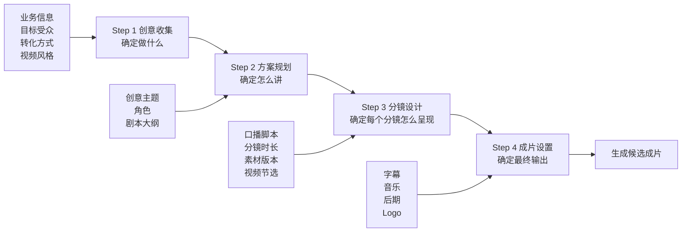
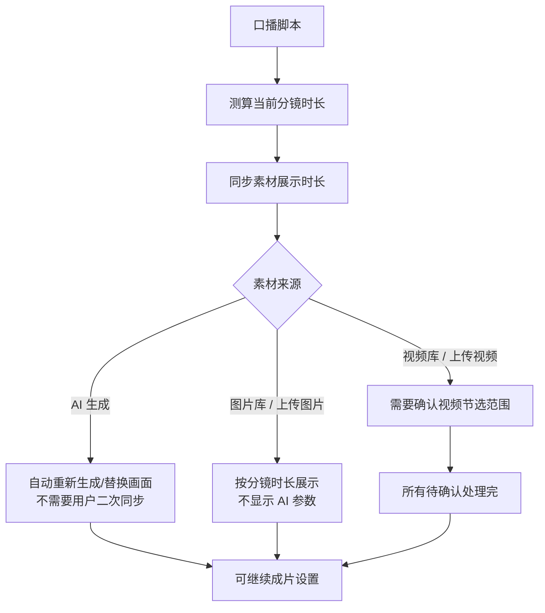
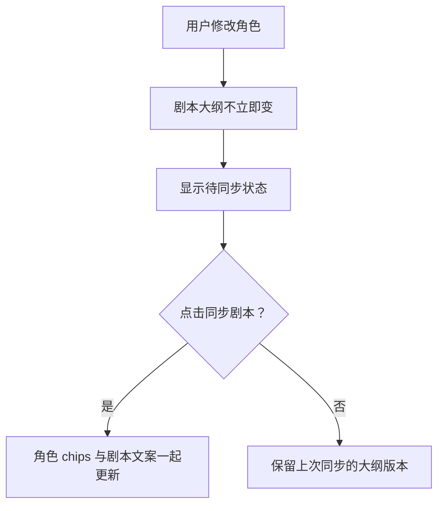
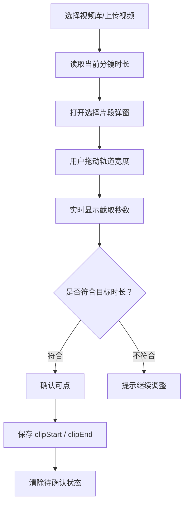
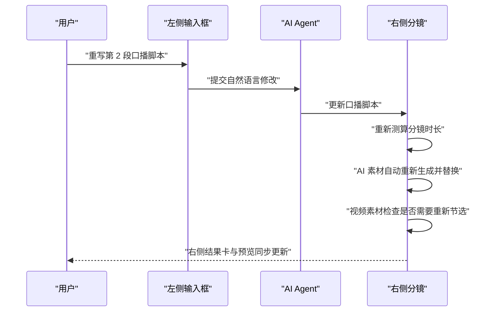
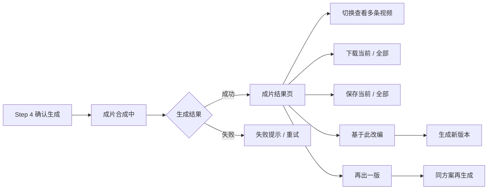
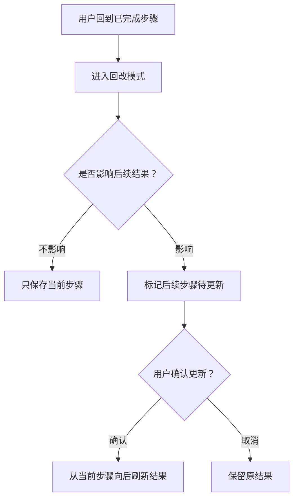

# 视频 Agent 交互设计交付文档

> 适用范围：AI 创编大师里的「视频 Agent 深度创编」主流程。  
> 说明边界：本文重点写交互、逻辑、页面框架、状态闭环；具体 UI 视觉样式、插画、色板、字体细节由 UI 同学后续定稿。  
> 阅读对象：上游 PM、下游前端研发、UI 设计同学。

---

## 0. 读者导览

| 角色 | 主要看什么 | 需要对齐的结论 |
| --- | --- | --- |
| PM | 流程目标、步骤边界、异常闭环 | 4 步流程是否完整，阻断条件是否合理 |
| 前端 | 页面框架、状态字段、交互状态表 | 每个状态如何触发、如何展示、如何恢复 |
| UI | 信息层级、组件关系、状态语义 | 哪些信息必须外露，哪些只做轻提示 |

---

## 1. 一眼看懂：总流程



### 核心因果链



---

## 2. 页面框架

### 深度创编主框架

```text
┌──────────────────────────────────────────────────────────────┐
│ 顶部：当前任务标题 + 4 步步骤条                              │
├───────────────┬───┬──────────────────────────────────────────┤
│ 左侧对话区    │ ↔ │ 右侧工作区                                │
│               │   │                                          │
│ Agent 过程     │   │ 当前步骤的可编辑结果                      │
│ 结果卡片       │   │ 表单 / 分镜 / 预览 / 设置                 │
│ 用户补充输入   │   │ 底部主 CTA                                │
└───────────────┴───┴──────────────────────────────────────────┘
```

| 区域 | 职责 | 交互规则 |
| --- | --- | --- |
| 顶部步骤条 | 告诉用户当前处于 4 步中的哪一步 | 已完成步骤可回看，未完成步骤灰态 |
| 左侧对话区 | 承接自然语言修改、展示 Agent 过程与结果卡 | 不重复展示右侧已外露的信息 |
| 中间分割线 | 调整左侧对话区与右侧工作区比例 | 默认浅灰可见，hover/拖动时高亮；保持左右结构，不做上下折叠 |
| 右侧工作区 | 当前步骤的主要操作场 | 用户主要确认、编辑、预览、处理异常 |
| 底部 CTA | 推进下一步 | 忙碌、缺字段、待确认、待同步时置灰并说明原因 |

### 响应式规则

| 场景 | 处理 |
| --- | --- |
| 宽屏 | 左侧对话区 + 右侧工作区横向布局 |
| 用户拖动分割线 | 只在安全范围内调整左右宽度 |
| 过窄视口 | 页面允许横向滚动，不改成上下结构 |
| 输入框过窄 | 限制最小宽度，避免右侧工作区被挤没 |

---

## 3. 全局交互原则

| 原则 | 说明 | 例子 |
| --- | --- | --- |
| 一个信息只在一个主位置外露 | 避免页面啰嗦 | 待确认只放在分镜卡和具体素材卡，不再放播放轴上方 |
| 状态颜色语义一致 | 用户一眼知道能不能继续 | 橙色只表示必须处理，紫色不用作警示 |
| 左侧说过程，右侧做确认 | 左侧不用替代右侧工作区 | 左侧结果卡引导“先看右侧”，右侧承接具体修改 |
| 能自动完成就不要让用户再点一次 | 降低认知负担 | 口播改写后，AI 素材自动重生成，不再出现“同步画面” |
| 素材能力由来源决定 | 不同来源不要展示无效操作 | 视频库/图片库/上传素材不显示出场角色和画面描述 |

### 状态色语义

| 状态 | 语义 | 推荐表现 | 是否阻断 |
| --- | --- | --- | --- |
| 普通 | 内容正常 | 白底、灰边 | 否 |
| 当前选中 | 当前正在编辑/预览 | 中性高亮或轻边框 | 否 |
| 待确认 | 用户必须处理 | 橙色标签/按钮 | 是 |
| 待同步 | 上游改动，需要用户确认同步 | 橙色提示 | 视情况 |
| 生成中 | 系统处理中 | loading、禁用重复提交 | 是 |
| 错误 | 生成失败或保存失败 | 红色提示 | 是 |
| 不可用 | 条件不满足 | 灰态按钮 + tooltip | 是 |

---

## 4. 四步流程总表

| 步骤 | 用户目标 | 页面主任务 | 关键产物 | 进入下一步条件 |
| --- | --- | --- | --- | --- |
| Step 1 创意收集 | 把需求说清楚 | 填写业务点、目标受众、转化方式、风格、补充信息 | 创意 brief | 必填项完整 |
| Step 2 方案规划 | 把内容结构定下来 | 确认主题、角色、剧本大纲 | 可执行方案 | 无待同步项 |
| Step 3 分镜设计 | 把方案变成可成片的分镜 | 编辑口播、管理素材、确认节选、预览效果 | 分镜脚本 + 素材组合 | 无待确认素材 |
| Step 4 成片设置 | 确认最终输出效果 | 配置字幕、音乐、后期、Logo | 全局成片配置 | 设置完整，可开始生成 |

---

## 5. Step 1：创意收集

### 页面结构

| 区域 | 内容 | 用户动作 | 系统反馈 |
| --- | --- | --- | --- |
| 左侧对话区 | Agent 理解与用户补充 | 输入补充要求 | 更新 brief |
| 右侧表单区 | 业务信息、视频信息 | 填写/修改字段 | 字段实时校验 |
| 底部 CTA | 确认信息，继续生成方案 | 点击推进 | 进入 Step 2 生成态 |

### 关键状态

| 场景 | 页面表现 | 恢复条件 |
| --- | --- | --- |
| 必填为空 | 字段提示，CTA 不通过 | 补齐必填项 |
| 用户补充一句话 | 左侧出现用户消息与 Agent 理解 | brief 更新完成 |
| 生成方案中 | 右侧骨架屏，CTA 禁用 | Step 2 结果生成 |
| 生成失败 | 错误提示 | 重试或修改输入 |

---

## 6. Step 2：方案规划

### 页面结构

| 模块 | 内容 | 操作 |
| --- | --- | --- |
| 创意主题 | 当前方案主题 | 可重写、可由左侧输入框修改 |
| 角色 | 出场角色与口播角色 | 新增 AI 角色、从角色库新增、替换、删除 |
| 剧本大纲 | 分段标题、描述、出镜角色 | 单段编辑、整套重写、角色同步 |
| 底部 CTA | 确认方案，继续生成口播脚本/分镜 | 无待同步后可点 |

### 角色与剧本同步规则



| 触发 | 为什么这样做 | 用户看到 | 完成条件 |
| --- | --- | --- | --- |
| 新增/删除/替换角色 | 避免角色变了但剧本半更新 | 剧本大纲待同步 | 点击同步剧本 |
| 点击同步剧本 | 让角色与大纲一起进入新版本 | 生成中 | 大纲整体刷新 |
| 删除角色 | 保证至少保留可用角色 | 删除按钮可能置灰 | 角色数量满足规则 |

---

## 7. Step 3：分镜设计

### 页面结构

```text
左侧编辑区
  1. 当前分镜口播脚本
  2. 当前分镜素材版本
  3. AI 素材参数：出场角色、画面描述
  4. 提交修改

右侧预览区
  1. 当前分镜预览
  2. 分镜设置：角色画中画、提示语、Logo
  3. 整片播放轴
  4. 分镜缩略卡列表
  5. 进入成片设置 CTA
```

### 口播脚本是时长锚点

| 规则 | 说明 |
| --- | --- |
| 口播脚本最大 | 分镜时长由口播脚本文字测算 |
| 分镜时长跟随口播 | 文案变化后，当前分镜时长重新计算 |
| 素材展示时长跟随分镜 | 每个素材展示时长同步为当前分镜时长 |
| 无意义字段不展示 | 不展示“字数是否对齐”“时长锚点已生效”等解释型字段 |

### 素材来源与编辑能力

| 素材来源 | 是否显示出场角色 | 是否显示画面描述 | 是否需要裁剪 | 是否允许待确认 | 说明 |
| --- | --- | --- | --- | --- | --- |
| AI 生成素材 | 是 | 是 | 否 | 否 | 用户可调角色与画面描述 |
| 视频库素材 | 否 | 否 | 是 | 是 | 用户只处理素材版本、口播、节选 |
| 上传视频 | 否 | 否 | 是 | 是 | 同视频库 |
| 图片库素材 | 否 | 否 | 否 | 否 | 不显示 AI 参数 |
| 上传图片 | 否 | 否 | 否 | 否 | 同图片库 |

### 素材版本交互

| 操作 | 入口 | 结果 |
| --- | --- | --- |
| 切换素材 A/B/C | 左侧素材卡 / 预览左上角素材切换器 | 左侧编辑内容、预览画面、缩略卡同步切换 |
| 添加 AI 素材 | 添加素材 → AI 生成 | 新增素材，显示出场角色和画面描述 |
| 添加视频素材 | 添加素材 → 视频库/上传视频 | 新增素材，进入节选确认 |
| 添加图片素材 | 添加素材 → 图片库/上传图片 | 新增素材，不显示 AI 参数 |
| 删除素材 | 素材卡 hover 删除 | 移除该素材版本 |
| 超过 3 个素材 | 添加按钮置灰 | 删除已有素材后恢复 |

### 预览区素材切换

```text
┌──────────────────────────────────────┐
│ 分镜一 · [ <  素材 A / 3  > ]        │
│                                      │
│ 当前分镜预览画面                     │
└──────────────────────────────────────┘
```

| 控件 | 作用 |
| --- | --- |
| 分镜名称 | 告诉用户当前在哪个分镜 |
| 素材 A / 3 | 告诉用户当前分镜有几个素材版本 |
| 左右箭头 | 只切当前分镜内的素材版本，不切分镜 |
| 分镜切换 | 由下方分镜缩略卡完成 |

### 视频节选闭环



| 状态 | 出现位置 | 用户动作 | 处理后 |
| --- | --- | --- | --- |
| 待确认节选 | 分镜缩略卡、左侧具体视频素材卡 | 点击确认/重新节选 | 打开选择片段弹窗 |
| 已确认节选 | 左侧显示中性节选时间 | 无需操作 | 可继续下一步 |
| AI 自动同步 | 不给警示色 | 无需操作 | 直接更新素材 |

### 用户用左侧输入框重写口播脚本



| 素材类型 | 口播改写后的处理 |
| --- | --- |
| AI 生成素材 | 自动重新生成并替换，不显示“同步画面” |
| 视频库/上传视频 | 时长变化后，如需用户处理，显示橙色待确认节选 |
| 图片库/上传图片 | 展示时长同步，不显示 AI 参数 |

### Step 3 待确认展示规则

| 位置 | 是否展示 | 原因 |
| --- | --- | --- |
| 分镜缩略卡 | 展示 | 用户知道哪个分镜有待处理素材 |
| 左侧具体素材卡 | 展示 | 用户知道是素材 B 还是素材 C 要处理 |
| 播放轴上方 | 不展示 | 避免重复，占用高度 |
| 底部左侧提示 | 不展示重复文案 | 分镜卡已经外露 |
| AI 素材卡 | 不展示警示色 | 用户无法裁剪，也不需要确认 |

### Step 3 CTA 阻断

| 条件 | CTA 状态 |
| --- | --- |
| 所有视频节选都已确认 | 可进入 Step 4 |
| 任一视频素材待确认 | 置灰，提示具体分镜/素材 |
| 当前有空分镜 | 置灰，需生成/导入或取消 |
| 正在生成/替换素材 | 置灰，等待完成 |

---

## 8. Step 4：成片设置

### 页面目标

Step 4 是对所有候选成片统一设置，不支持单条候选成片单独配置。

| 模块 | 操作 | 影响范围 |
| --- | --- | --- |
| 成片组合预览 | 切换候选组合预览 | 只切预览，不产生单独设置 |
| 字幕 | 开关、字体、颜色、位置 | 全部候选成片 |
| 音乐 | 选择音乐、音量 | 全部候选成片 |
| 后期 | 智能后期开关 | 全部候选成片 |
| Logo | 添加、移除、位置 | 全部候选成片 |

### 不支持的交互

| 不做 | 原因 |
| --- | --- |
| 单个组合独立设置 | 当前产品规则为全局设置 |
| “同步全部”按钮 | 设置本身就是全局，不需要同步 |
| 每张候选卡独立配置 | 会增加理解成本，也不符合产品决策 |

### Step 4 状态

| 场景 | 页面表现 | 用户动作 |
| --- | --- | --- |
| 配置完整 | 主 CTA 可点击 | 确认生成 |
| 正在生成成片 | loading，禁止重复提交 | 等待 |
| 生成失败 | 错误提示 | 重试 / 返回修改 |
| 生成成功 | 展示成片结果页 | 下载 / 保存 / 改编 / 再生成 |

---

## 9. 成片结果页：结果查看与二次操作

### 页面目标

成片结果页不是继续配置参数的页面，而是让用户快速完成 4 件事：看当前结果、切换多条结果、保存/下载、基于结果继续创作。

```text
┌──────────────────────────────────────────────┐
│ 已生成 N 条视频                 比例 / 类型 / 组合公式 │
├──────────────────────────────────────────────┤
│                                              │
│  视频预览区                                  │
│  左上：组合 01                               │
│  右上：下载 / 保存 / 信息                    │
│                                              │
├──────────────────────────────────────────────┤
│ 基于此改编   再出一版       <  1 / N  >      │
└──────────────────────────────────────────────┘
```

### 结果数量规则

| 结果数量 | 页面表现 | 用户能做什么 |
| --- | --- | --- |
| 1 条视频 | 标题显示“已生成 1 条视频”，不展示页码切换 | 播放、下载、保存、基于此改编、再出一版 |
| 多条视频 | 标题显示总数，底部展示 `当前序号 / 总数` | 左右切换查看不同组合结果 |

### 多视频切换

| 操作 | 页面反馈 | 影响范围 |
| --- | --- | --- |
| 点击左箭头 | 切到上一条视频，组合标签和播放器同步更新 | 只切当前预览 |
| 点击右箭头 | 切到下一条视频，组合标签和播放器同步更新 | 只切当前预览 |
| 到第一条继续点上一条 | 循环到最后一条 | 不改变已生成结果 |
| 到最后一条继续点下一条 | 循环到第一条 | 不改变已生成结果 |

### 右上角工具栏

| 入口 | 单条视频 | 多条视频 | 完成反馈 |
| --- | --- | --- | --- |
| 下载 | 直接下载当前视频 | 弹出“下载当前视频 / 下载全部视频” | Toast：已开始下载 |
| 保存 | 直接保存当前视频到原料库 | 弹出“保存当前视频 / 保存全部视频” | Toast：已保存到原料库 |
| 信息 | 展示任务 ID / 成片信息 | 展示当前视频对应的信息 | 可复制任务 ID |

### 底部操作

| 操作 | 触发后发生什么 | 新旧结果关系 |
| --- | --- | --- |
| 基于此改编 | 以当前正在看的视频为源，进入继续改编流程 | 保留原视频，生成新版本 |
| 再出一版 | 沿用同一套分镜、素材组合和全局设置，再生成一批结果 | 原结果不覆盖，新结果作为同方案版本 |

### 结果页状态

| 状态 | 页面表现 | 用户动作 |
| --- | --- | --- |
| 正在合成 | 显示视频生成中，不展示下载/保存 | 等待 |
| 全部成功 | 展示总数、播放器、工具栏和页码 | 查看与操作 |
| 部分成功 | 标明成功条数，失败条目可重试 | 先查看成功结果，必要时重试 |
| 全部失败 | 错误提示 + 重试入口 | 重试或返回修改 |
| 保存失败 | 当前菜单关闭，Toast 提示失败原因 | 重新保存 |
| 下载失败 | Toast 提示失败原因 | 重新下载 |

### 状态闭环



---

## 10. 左侧 Agent 对话规则

| 信息类型 | 是否展示 | 展示方式 |
| --- | --- | --- |
| 用户输入 | 展示 | 用户消息气泡 |
| Agent 语义理解 | 可折叠展示 | 简短，不占右侧确认职责 |
| 结果卡 | 展示 | 告知“右侧已更新”，点击可定位右侧 |
| 重复小标题 | 不展示 | 例如“分镜已生成”不再单独出现 |
| 生成中状态 | 只保留一个主位置 | 避免左右同时说同一件事 |

### 左侧输入框能力

| 当前步骤 | 支持输入 |
| --- | --- |
| Step 1 | 补充业务诉求、修改 brief |
| Step 2 | 重写主题、改角色、重写大纲 |
| Step 3 | 重写口播、改 AI 素材画面、添加分镜/素材 |
| Step 4 | 调整字幕、音乐、后期、Logo 等全局成片设置 |

---

## 11. 跨步骤回改规则



| 回改位置 | 影响范围 | 系统处理 |
| --- | --- | --- |
| Step 1 创意信息 | Step 2/3/4 | 后续方案、分镜、成片需重新生成 |
| Step 2 角色/大纲 | Step 3/4 | 分镜和成片需重新同步 |
| Step 3 口播/素材 | Step 4 | 成片组合与设置需重新确认 |
| Step 4 设置 | 只影响最终输出 | 不反向影响分镜 |

---

## 12. 异常与阻断闭环

| 场景 | 触发条件 | 页面表现 | 用户动作 | 恢复条件 |
| --- | --- | --- | --- | --- |
| 必填为空 | 点击下一步 | 字段提示，CTA 不通过 | 补齐字段 | 必填完整 |
| 生成失败 | 接口失败/超时 | 红色错误提示 | 重试/修改输入 | 生成成功 |
| 角色待同步 | Step 2 改了角色 | 橙色待同步 | 点击同步剧本 | 大纲刷新完成 |
| 视频待确认 | 视频时长需节选 | 橙色待确认 | 裁剪并确认 | 清除待确认 |
| 素材超限 | 当前分镜已有 3 个素材 | 添加入口置灰 | 删除已有素材 | 少于 3 个 |
| 空分镜 | 新增后未生成/导入 | 空分镜卡 + 取消 | 生成/导入/取消 | 分镜有效或取消 |
| 正在生成 | 任一生成任务执行中 | 禁用重复提交 | 等待 | 任务结束 |
| 未解锁步骤 | 点击未来步骤 | 灰态不可点 | 完成当前步骤 | 步骤解锁 |

---

## 13. 前端状态字段建议

| 状态对象 | 字段建议 | 用途 |
| --- | --- | --- |
| 流程 | `currentStep` | 当前步骤 |
| 流程 | `maxReachedStep` | 控制步骤条可点击范围 |
| 生成 | `generationState` | loading、targetStep、skeleton |
| 对话 | `composerGenerationState` | 左侧输入框生成中 |
| 回改 | `downstreamStatus` | 标记后续步骤待更新 |
| 分镜 | `activeStoryboardIndex` | 当前编辑分镜 |
| 分镜 | `previewStoryboardIndex` | 当前预览分镜 |
| 素材 | `activeMediaIndex` | 当前素材版本 |
| 素材 | `sourceType` | AI、library、upload |
| 素材 | `assetType` | video、image |
| 素材 | `clipReviewStatus` | 是否待确认节选 |
| 素材 | `clipStartSeconds / clipEndSeconds` | 视频节选范围 |
| 成片 | `finalSettings` | 全局字幕、音乐、后期、Logo |
| 结果 | `generatedVideoCount` | 已生成视频总数 |
| 结果 | `activeGeneratedVideoIndex` | 当前正在查看的视频序号 |
| 结果 | `resultVideoUrls` | 多条成片地址 |
| 结果 | `videoHoverMenu` | 下载/保存/信息菜单状态 |
| 结果 | `resultRelationType` | 基于改编、再出一版等版本关系 |

---

## 14. 前端实现关注点

| 模块 | 研发关注点 |
| --- | --- |
| 左右布局 | 保持横向结构，分割线可拖动，有最小安全宽度 |
| 状态去重 | 同一状态不要在左侧、右侧、底部重复出现 |
| 素材能力判断 | 根据 `sourceType + assetType` 控制面板显示 |
| 口播时长 | 口播变化后统一触发分镜时长和素材时长同步 |
| AI 素材替换 | 保留生成动效和右侧更新动效 |
| 视频裁剪 | 保存范围后清除待确认状态 |
| CTA 阻断 | 每个置灰按钮都要有原因提示 |
| Step 4 | 设置为全局，不写单组合设置逻辑 |
| 成片结果页 | 多视频切换只影响当前预览，不反向修改配置 |
| 下载/保存 | 多视频时必须区分“当前”和“全部”两个 scope |

---

## 15. 交付验收清单

| 检查项 | 是否通过 |
| --- | --- |
| 4 步流程能从 Step 1 跑到 Step 4 |  |
| 用户知道每一步当前要确认什么 |  |
| 左侧对话区和右侧工作区职责清晰 |  |
| 分割线默认可见，hover/拖动时高亮 |  |
| 窄屏不会变成上下结构 |  |
| Step 2 角色变化不会偷偷改剧本 |  |
| Step 2 待同步必须点击同步剧本才更新 |  |
| Step 3 口播脚本能驱动分镜时长 |  |
| AI 生成素材才显示出场角色和画面描述 |  |
| 视频库/图片库/上传素材不显示 AI 参数 |  |
| 视频库/上传视频有选择片段闭环 |  |
| AI 素材因口播变化自动重新生成，不出现同步按钮 |  |
| 待确认只用橙色 |  |
| AI 自动完成不使用警示色 |  |
| 待确认只出现在分镜卡和具体素材卡 |  |
| 播放轴上方没有重复待确认提示 |  |
| 预览左上角素材切换只切素材，不切分镜 |  |
| 下方分镜卡负责切分镜 |  |
| 所有待确认处理完才能进入 Step 4 |  |
| Step 4 没有“同步全部”与单组合设置 |  |
| Step 4 设置影响全部候选成片 |  |
| 生成中状态不在多个位置重复表达 |  |
| 成片结果页单视频不展示页码 |  |
| 成片结果页多视频可用 `1/N` 切换查看 |  |
| 多视频下载有“当前/全部”选择 |  |
| 多视频保存有“当前/全部”选择 |  |
| 基于此改编保留原视频并生成新版本 |  |
| 再出一版不覆盖原结果 |  |

---

## 16. 一句话总结

视频 Agent 是一个「左侧自然语言协作 + 右侧四步可确认结果」的创编状态机：  
Step 1 定方向，Step 2 定方案，Step 3 用口播脚本驱动分镜时长和素材闭环，Step 4 做全局成片设置。所有交互都围绕一句话判断：用户现在能做什么、必须处理什么、处理完后能不能继续。
