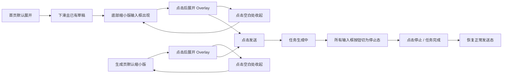

# 输入框交互说明（可视化速览版）

## 一眼看懂

| 模块 | 规则 |
| --- | --- |
| 适用页面 | 首页输入框、生成页输入框 |
| 是否共用逻辑 | 是，必须完全一致 |
| 一次可提交任务数 | 1 个 |
| 发送按钮可用条件 | 有文本输入，且当前没有任务生成中 |
| 生成中按钮状态 | 全部切为“停止生成” |
| 图片/视频 | 放在顶部素材行 |
| 落地页/脚本 | 不放顶部素材行，走挂载型按钮 |
| 缩小版输入框 | 只保留图片/视频缩略图 + 单行文本 + 发送/停止按钮 |

---

## 输入框结构

```text
┌──────────────────────────────────────────────┐
│ ① 上传入口  ② 顶部素材行（仅图片/视频）        │
│                                              │
│ ③ 文本输入区（支持 @ 引用）                   │
│                                              │
│ ④ 底部控制条                  ⑤ 发送/停止按钮 │
└──────────────────────────────────────────────┘
```

---

## 页面状态图



---

## 上传与素材规则

### A. 上传入口

| 状态 | 表现 |
| --- | --- |
| 默认 | 只显示加号 |
| 点击后 | 弹出 4 项选择面板 |
| 面板选项 | 图片-图片库选择 / 图片-本地上传 / 视频-视频库选择 / 视频-本地上传 |

### B. 素材去哪里

| 素材类型 | 展示位置 | 数量限制 |
| --- | --- | --- |
| 图片 | 顶部素材行 | 不限 |
| 视频 | 顶部素材行 | 不限 |
| 落地页 | 底部挂载按钮 | 最多 1 个 |
| 口播脚本 | 底部挂载按钮 | 最多 1 个 |

### C. 顶部素材行

| 情况 | 表现 |
| --- | --- |
| 素材不多 | 正常平铺 |
| 素材过多 | 横向滚动 |
| 左侧还有内容 | 显示左箭头 |
| 右侧还有内容 | 显示右箭头 |

---

## 文本与 @ 引用

### A. `@` 可引用来源

| 来源 | 是否可被 @ 引用 |
| --- | --- |
| 已上传图片 | 是 |
| 已上传视频 | 是 |
| 已添加落地页 | 是 |
| 已添加脚本 | 是 |

### B. 插入后的显示方式

| 引用类型 | 样式 |
| --- | --- |
| 图片/视频 | 缩略图 + 名称的小标签 |
| 落地页/脚本 | 图标 + 名称的小标签 |

### C. 对齐要求

- 必须和正文在同一行基线内
- 看起来像一句话里的内联 token
- 不能浮在文本上方，也不能像独立卡片

---

## 落地页 / 脚本交互

### A. 添加

| 项目 | 方式 |
| --- | --- |
| 落地页 | 点击“落地页参考”打开全屏弹层 |
| 脚本 | 点击“口播脚本”打开全屏弹层 |

### B. 本期交互口径

| 项目 | 规则 |
| --- | --- |
| 落地页 | 输入非空即允许确认，不做真实解析 |
| 脚本 | 输入非空即允许确认 |

### C. 添加后

```text
初始按钮 → 已挂载态胶囊 → 可 hover 看内容 → 可删除 → 删除后恢复初始按钮
```

### D. Hover 内容

| 类型 | Hover 展示 |
| --- | --- |
| 落地页 | URL |
| 脚本 | 脚本内容预览 |

### E. 删除联动

| 删除对象 | 连带动作 |
| --- | --- |
| 落地页 | 文本中的 `@[落地页]` 一并移除 |
| 脚本 | 文本中的 `@[脚本]` 一并移除 |

---

## 发送按钮状态

| 状态 | 条件 | 按钮表现 | 是否可点击 |
| --- | --- | --- | --- |
| 禁用态 | 文本为空 | 灰色禁用按钮 | 否 |
| 可发送态 | 文本非空，且无任务生成中 | 渐变发送按钮 | 是 |
| 生成中态 | 已提交任务，正在生成 | 渐变停止按钮 + tooltip“停止生成” | 是 |

---

## 单任务锁

```text
有任务生成中
→ 不允许再提交第二个任务
→ 所有输入框实例统一切成停止态
→ 用户只能等待完成，或点击停止
```

---

## 首页 / 生成页的缩小版输入框

### 展示内容

| 内容 | 是否展示 |
| --- | --- |
| 图片/视频缩略图 | 是 |
| 正文单行预览 | 是 |
| 落地页缩略块 | 否 |
| 脚本缩略块 | 否 |
| 发送/停止按钮 | 是 |

### 文本优先级

| 情况 | 缩小版展示文案 |
| --- | --- |
| 有正文 | 展示正文，单行截断 |
| 无正文，但有落地页/脚本 | 展示字段语义摘要 |
| 无正文，仅有图片/视频 | 展示默认提示文案 |

---

## 边界情况总表

| 场景 | 结果 |
| --- | --- |
| 只上传图片，没有文本 | 不能发送 |
| 只添加落地页，没有文本 | 不能发送 |
| 只添加脚本，没有文本 | 不能发送 |
| 已有落地页，再次添加 | 不允许，需先删除 |
| 已有脚本，再次添加 | 不允许，需先删除 |
| 点击页面空白 | 关闭 overlay、菜单、@ 面板 |
| 非图片/视频文件 | 不进入素材行 |
| 落地页为空点确认 | 阻止确认 |
| 脚本为空点确认 | 阻止确认 |
| 任务完成 | 停止态恢复发送态 |
| 点击停止 | 停止态恢复发送态，并中断当前任务 |

---

## 验收清单

### 研发自查

- 首页和生成页逻辑是否完全一致
- 文本为空时是否一定不能发送
- 图片/视频是否只进入顶部素材行
- 落地页/脚本是否只走挂载态按钮
- `@` 是否能引用全部已添加素材
- 删除挂载素材后，正文引用是否同步删除
- 生成中时，所有输入框按钮是否同步切为停止态
- 缩小版输入框是否也切为停止态
- 素材过多时，左右箭头是否按需出现

### 测试最小回归集

1. 空文本 + 图片
2. 空文本 + 落地页
3. 文本 + 图片
4. 文本 + 图片 + 落地页 + 脚本
5. 首页展开态发送
6. 首页缩小态停止
7. 生成页展开态发送
8. 生成页缩小态停止
9. 删除落地页并重新添加
10. 删除脚本并重新添加

---

## 给研发的一句话结论

把它当成“一个统一输入组件 + 两种展示形态（展开 / 缩小）+ 一个单任务生成状态机”来实现，不要让首页、生成页、缩小版各自维护三套不同逻辑。
